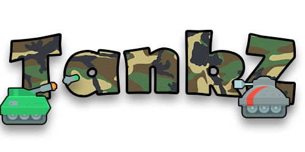

 TANKZ is a multiplayer turn-based artillery game.
 
 Built using plain C# (WinForms, System.Drawing etc.)
 Server-client communication via SignalR hosted on Azure.
  
Controls:
<ul>
  <li>[&#160;&#160;&#160;&#160;␣&#160;&#160;&#160;] - Shoot / Go to the next tank phase
  <li>[&#160;←][&#160;→] - Move Tank / Rotate Barrel
  <li>[&#160;↑&#160;&#160;][&#160;↓&#160;] - Adjust shooting power
  <li>[&#160;Z&#160;] - Undo (For development purposes)
</ul>

! WIP

Sprites used:
https://kenney.nl/assets/tanks
